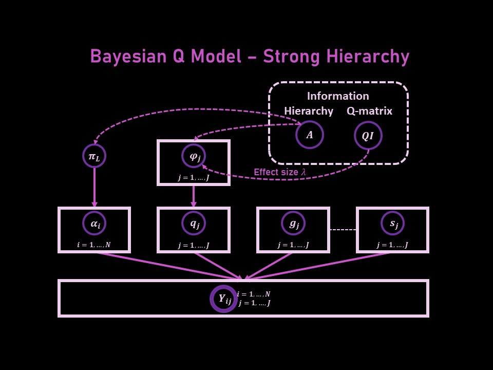

# Bayesian Estimation for Q-matrix with Hierarchy Information 
___________________________________

Heesang Ann *sang3798@snu.ac.kr*

 
 

There have been several approaches that estimate or validate Q-matrix of Cognitive Diagnostic Assessment. However, in reality, it is hard to apply those methods, because the majority of them raise problems of interpretation or bring inappropriate results that do not match with the original measurement targets.   

This research modified Bayesian Q-matrix estimation method originally suggested by Chung(2014) to be more useful in real educational situation. First, in reality, the independence of attributes can not be garrented, and many of them have hierarchy structures. Second, since data can not understand the context, in many cases, to obtain meaningful results, test developers' suggestions and educational experts' opinions should be considered more importantly. The new method estimates Q-matrix under the given hierarchy struncture condition in a Bayesian framework, and suggests how to reflect test developers' opinions during the estimation process. 

 

#### *Keywords*
- *Cognitive diagnostic Assessment*  
   CDA is designed to measure specific knowledge structures and processing skills in students so as to provide information about their cognitive strengths and weaknesses. (Leighton & Griel, 2007)  
 
    
- *Q-matrix*   
   The incidence matrix which identify the relationship between items and attributes(skills).  
   
   $$Q=(q_{jk})_{JxK}, \;\;\; where \;\;\; q_{jk}=
\begin{cases}
1,\;if \;item \; j \;requires \;attribute\; k\\
0,\;o.w.\;
\end{cases}$$
    

- *Attribute pattern*   
   A vector that shows whether an examinee mastered each attributes or not.
   $$\alpha_i = (\alpha_{i1}, \alpha_{i2}, ..., \alpha_{iK}),\;\;\; where\;\;\; \alpha_{ik}=
\begin{cases}
1,\;if \;examinee \; i \;mastered \;attribute\; k\\
0,\;o.w.\;
\end{cases}$$
    

- *DINA model*   
For examinee $i$, the probability of correct answer for item $j$ is  
   
$$Pr(Y_{ij} = 1|\alpha_{i}) = (1-s_j)^{\eta_{ij}}{g_j}^{(1-\eta_{ij})}$$  
   
$$ where \;\; \alpha_i = (\alpha_{i1}, \alpha_{i2}, ..., \alpha_{iK}) : \; \; attribute \; pattern \; for\;  examinee \; i , $$
$$ s_j \; : \;\; slip \; parameter \; for \; item \; j, $$
$$ g_j \; : \;\; guess \; parameter \; for \; item \; j, $$
$$and \;\; \eta_{ij}=
\begin{cases}
1,\;if \; examinee \; i \;mastered \;all\; required\; skills\; for\; item\; j\\
0,\;o.w.\;
\end{cases}$$
   
    DINA model is one of the simplest and the most common-used CDMs. 
 
    
- *Hierarchy*  
    If attribute $i$ should be mastered to master attribute $j$, then we say that these two attributes have hierarchy structure. In this case, attribute $i$ is a precedence attribute for attribute $j$, and attribute $j$ is a following attribute for attribute $i$.  
    Hierarchy structure between attributes is usually discribed by a directed graph or an adjacent matrix. 
   
 
    

----------------------

## Q-matrix Bayesian Model - Strong Hierarchy version 

 
 

  
 

### 1.Strong Hierarchy Condition
 

- *Possible attribute pattern*  
In condition of strong hierarchy structure, attribute patterns of examinees should follow the hierarchy structure. Thus, only some of attribute patterns, not all of them, are possible for attribute patterns of examinees.  
The set of posstible attribute patterns can be easily obtained by the columns of the access matrix $R = I+A+A^2+A^3 + ....$  

  *(cf. In the case of weak hierarchy structure, attribute patterns of examinees do not have to follow the hierarchy structure, but the proportion of attribute patterns that follow the structure is $k$ times ($k>1$) larger than that of attribute patterns that do not follow the structure.)* 
 

- *Equivalence relationship for q-vectors*                                            
In strong hierarchyy condition, two different q-vectors can have same likelihood. If we define equivalence relationship for q-vectors when two of them have same likelihood, the ratio of posterior probabilities for equivalent q-vectors is equal to that of prior probabilities. That means, data can not distinguish equivalent q-vectors, and we can not obtain additional information for q-vectors in the same equivalence class.  
Hence, to estimate q-vectors efficiently, the bayesian model decides only which equivalence classes each q-vectors belong to, and among the q-vectors in the classes, choose q-vectors that are close to experts' suggestion. 
  

__Notations__ 
  - $N$ : Number of examinees
  - $J$ : Number of items
  - $K$ : Number of attributes
  - $L$ : Number of possible attribute patterns
  - $a_0, a_1, ..., a_{2^K-1} \;\;\; (a_0 = (0,0,...,0),\;\; a_{2^K-1}=(1,1,...,1) )$ :  all attribute patterns 
  - $a_{c_1}. a_{c_2}, ... , a_{c_L} \;\;\; (L<2^K,\;\; c_1=0, \;\; c_L=2^K-1)$  :  possible attribute patterns 
  - $C_H = \{c_1, c_2, ...,c_L \}$ : the set of corresponding class numbers to possible attribute patterns
  -  $ \tilde{a_{c_2}}. \tilde{a_{c_2}}, ... , \tilde{a_{c_L}} $  : equivalence classes for q-vectors   
   *(There is one to one correspondence between equivalence classes and nonzero possible attribute patterns.)* 
 
 

### 2. Information Input

- Response data $Y=(Y_{ij})_{NxK}$  
$$Y_{ij}=
\begin{cases}
1,\;if \;examinee\; i \;answered \; item \; j \; correctly \\
0,\;if \;examinee\; i \; answered \; item \; j \;wrong
\end{cases}$$
    

- Adjacent matrix $A$ that discribes the hierarchy structure
    
   $$A=(A_{k_1k_2})_{KxK}, \;\;\; where \;\;\; A_{k_1k_2}=
\begin{cases}
1,\;if \;attribute \; k_1 \;is \; necessary \; for \; attribute \; k_2\\
0,\;o.w.\;
\end{cases}$$
       
- Q-matrix information matrix $Q_I$ suggested by test developers and educational experts.  

   
   $$Q_I=(q'_{jk})_{JxK}, \;\;\; where \;\;\; q'_{jk}=Pr(q_{jk}=1) 
$$ 

> Ex.  $q'_{jk}=0.7$ means that experts thought there is a 70% probability that attribute $k$ is necessary for item $j$.  
$\;\;\;\;$Or, seven out of 10 experts agreed $q_{jk}=1$.

- Effect size $\lambda$ which is the reflection degree of expert's opinion. (default : $\lambda = 1$)
   
   

### 3. Variables 
  - $\alpha_{i}= (\alpha_{i1}, \alpha_{i2}, ..., \alpha_{iK}), \; for\; i=1,2,...,N$ : attribute pattern for examinee $i$
  - $\pi_L = ( \pi_{c_1}, \pi_{c_2}, ... , \pi_{c_L})$ : pmf for each  $L$ possible attribute patterns
  - $g_j, \; for\; j=1,2,...,J$ : guess parameter for item $j$
  - $s_j, \; for\; j=1,2,...,J$ : slip parameter for item $j$
  - $n_j, \; for\; j=1,2,...,J$ : equivalence class number for  q-vector for item $j$ ($n_j \in C_H-\{c_1\}$)
  - $Q_n=(n_1, n_2, ..., n_J)^T$ : vector of equivalence class numbers for q-vectors 
  - $\phi_{j}=(\phi_{c_2}^{(j)},\phi_{c_3}^{(j)}, ..., \phi_{c_L}^{(j)}), \; for\; j=1,2,...,J$ : pmf for each $L-1$ equivalence classes for q-vector for item $j$
 
 

### 4. Model
Likelihood on DINA Model : 
$$Pr(Y_{ij} = 1|\alpha_{i}, q_{j}, s_{j}, g_{j}) = (1-s_j)^{\eta_{ij}}{g_j}^{(1-\eta_{ij})}, \;\;\; where \;\;\; \eta_{ij}=
\displaystyle\prod_{k=1}^{K}{(\alpha_{ik})^{q_{jk}}}$$  
Priors : 
  - $Pr(\alpha_i = a_c|\pi_L) =
\begin{cases}
\pi_c,\;\;if \;c \in C_H \\
0,\;\; if \;c \in \{0,1,...,2^K-1\}-C_H\;
\end{cases}$
  - $\pi_L \sim dirichlet(1,1,...,1)$
  - $p(s_j , g_j) \propto {s_j}^{\alpha_s -1}{(1-s_j)}^{\beta_s -1}{g_j}^{\alpha_g -1}{(1-g_j)}^{\beta_g -1}\;I(0\leq g_j <1-s_j \leq 1)$
  - $ Pr(n_j=c_l|\phi)=Pr(q_{j}\in  \tilde{a_{c_l}}) = \phi_{c_l}$
  - $\phi_{j} \sim dirichlet(\lambda p_{c_2}^{(j)},\lambda p_{c_3}^{(j)}, ..., \lambda p_{c_L}^{(j)}),  \;\;\;where \;\;\;p_{c_l}^{(j)} = \displaystyle\sum_{a_c \in \tilde{a_{c_l}}}{Pr(q_j = a_c)}/(1-{p_0}^{(j)})$  
  
> Each  $Pr(q_j = a_c)$ for all q-vector candidates $a_c$'s and  ${p_0}^{(j)}=Pr(q_j=(0,0,...,0))$ are computed by multiplying probabilities for each entries that can be obtained from $QI$ matrix. 

   

Posterior Calculation : 
  - $\alpha_i$'s and $n_j$'s : calculted by multiplying prior pmf and likelihoods
  - $\pi_L$ and $\phi_{j}$'s : use the fact that Dirichlet prior is the conjugate prior for Multinomial distribution
  - $g_j$'s and $s_j$'s : use the fact that Beta prior is the conjugate prior for Binomial distribution
 
   

